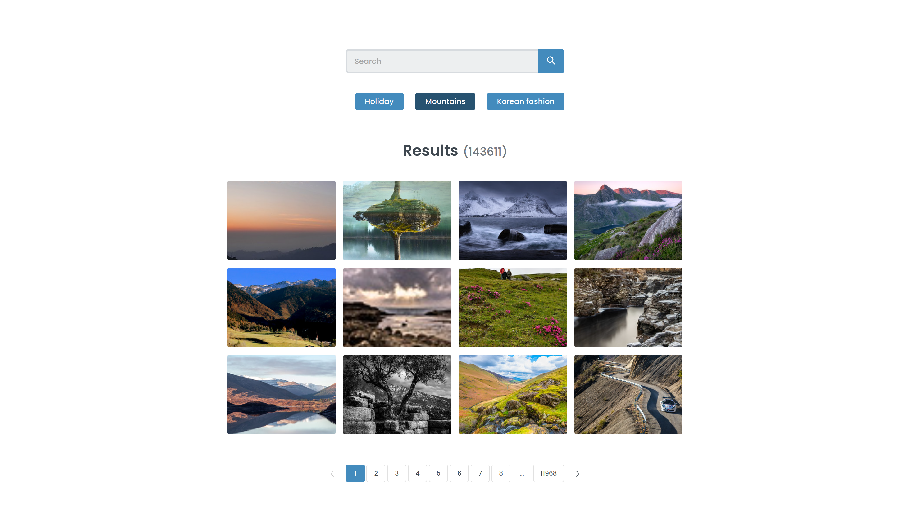

# FSJS - React Gallery

This is my project 7 solution in the Treehouse FSJS techdegree. 

The list below includes features that have been required (*). The rest has been added on top of the project requirements.

| Features            | Description                                                 |
| :------------------ | :---------------------------------------------------------- |
| React router (*)    | Setup routes and redirects, utilize query parameter         |
| Flickr API (*)      | Search images from Flickr                                   |
| 404 page (*)        | Add many clip-path animations and transitions               |
| Pagination          | Responsive pagination with segmentation                     |
| More API requests   | Request page by page and view all results                   |
| Lightbox            | Implement lightbox to view the fetched images               |
| Hooks and utils     | Create custom hooks and utility functions                   |
| Project structure   | Organized folder structure, setup import aliases            |

Preview: 

Live URL: 
